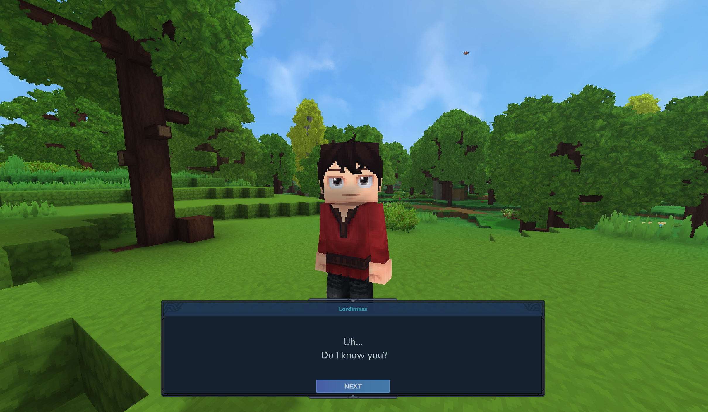

# Dialogue
[]()

[]()

Dialogue is a mod designed for Hytale server owners and developers to allow you to add custom dialogue and interactivity
to any NPC.
---
# Get Started
Dialogue adds a new NPC action `BeginDialogue` which is used to start a dialogue with a player. I recommend using this
inside of the `InteractionInstructions` block for your NPC. Here's a basic setup for your `InteractionInstruction`
block:
```json
{
  "InteractionInstruction": {
    "Instructions": [
      {
        "Continue": true,
        "Sensor": {"Type": "Any"},
        "Actions": [
          {
            "Type": "SetInteractable",
            "Interactable": true,
            "Hint": "dialogue.interactionHints.talk"
          }
        ]
      },
      {
        "Sensor": {"Type": "HasInteracted"},
        "Instructions": [
          {
            "Sensor": {
              "Type": "Not",
              "Sensor": {
                "Type": "State",
                "State": "$Interaction"
              }
            },
            "Actions": [
              {"Type": "LockOnInteractionTarget"},
              {
                "Type": "BeginDialogue",
                "Dialogue": "IntroDialogue01"
              },
              {
                "Type": "State",
                "State": "$Interaction"
              }
            ]
          }
        ]
      }
    ]
  }
}
```
The `Dialogue` parameter for the `BeginDialogue` refers to the ID of a `DialogueAsset`, which should be placed in 
`Server/Dialogue/`. These assets are the core of Dialogue's functionality, as they define the content and flow of the
interaction with NPCs. An example `DialogueAsset` is included below:
```json
{
  "Type": "Dialogue",
  "Entries": [
    {
      "Content": "dialogue.IntroDialogue01.content.0"
    }
  ],
  "Next": "IntroDialogue02"
}
```
| Key                | Example(s)                                                                                                                                                            | Description                                                                                                                                                                                                          |
|--------------------|-----------------------------------------------------------------------------------------------------------------------------------------------------------------------|----------------------------------------------------------------------------------------------------------------------------------------------------------------------------------------------------------------------|
| `Type`             | `"Dialogue"`, `"Choice"`                                                                                                                                              | The type of dialogue box to create. `"Dialogue"` is a standard box with text only, `"Choice"` creates a multiple choice box with different options for the player.                                                   |
| `Entries`          | `[{"Content": "Dialogue content!"}]`,<br><br> `[{"Content": "Option1", "NextId": "Option1DialogueResult"}, {"Content": "Option2", "Next": {"Type": "Dialogue", ...}]` | A list of `DialogueEntry` objects. If `Type` is `"Choice"` you can specify a `Next` on each entry to choose the dialogue asset to open when this option is chosen.                                                   |
| `Title`            | `"Name of Speaker"`                                                                                                                                                   | String text to add as a title to the dialogue box. Usually this will be the name of the entity speaking. Try `{username}` to include the player's name here.                                                         |
| `NextId`           | `"NextDialogueID"`                                                                                                                                                    | The ID of the next dialogue asset to open when the user clicks "Next". If this is ommitted, this will be treated as the last in the chain and the button will read "Close" instead.                                  |
| `Next`             | `{"Type": "Dialogue", "Entries": [...], ...}`                                                                                                                         | The next dialogue to open when the user clicks "Next". This is used instead of `NextId` to inline dialogue objects, preventing the necessity to create separate files for every new dialogue.                        |
| `TypewriterEffect` | `true`, `false`                                                                                                                                                       | Whether the character-by-character typing effect on a given dialogue should be enabled. Defaults to `true`.                                                                                                          |
| `Voice`            | `"F1"`,`"F2"`,`"F3"`,`"F4"`,`"M1"`,`"M2"`,`"M3"`,`"M4"`, `""`                                                                                                         | The voice to use for this dialogue. If omitted, a voice will be deterministically chosen based on `Title`, so dialogues with the same title wiill use the same voice. Set to the empty string `""` to disable voice. |

---
# Localisation and `.lang` Files
Dialogue fully supports localisation of NPC dialogue, simply supply the `.lang` keys in your `DialogueAssets` and the
mod will take the correctly localised string for the given player.
---
# Dynamic and Rich Text Content
Sometimes you want a splash of colour in your dialogue, or perhaps some *italics*, or maybe even to refer to the player 
by name? You can do all of this using placeholders and rich text tags. This is all supported in `.lang` files as well,
so you can keep your dynamic and rich text localised.

| Placeholder                              | Result                                         |
|------------------------------------------|------------------------------------------------|
| \<i>Italics\</i>                         | *Italics*                                      |
| \<b>Bold\</b>                            | **Bold**                                       |
| \<color is="#2e94ad">Colourful!\</color> | <span style="color: #2e94ad">Colourful!</span> |
|                                          |                                                |
| {username}                               | The player's username                          |
| {uuid}                                   | The player's UUID                              |
| {lang}                                   | The language the player is using, e.g. `en-US` |

You can even specify your own custom placeholders. Here's how we register the last three placeholders above:
```java
DialogueMod.get().registerParameter("{username}", PlayerRef.class, PlayerRef::getUsername);
DialogueMod.get().registerParameter("{uuid}", PlayerRef.class, p -> p.getUuid().toString());
DialogueMod.get().registerParameter("{lang}", PlayerRef.class, PlayerRef::getLanguage);
```
---
# Integration with NPC behaviour
NPCs which are being interacted with include the `NPCDialogueComponent`, which describes the current state of the
dialogue. This also comes paired with a `Dialogue` sensor which can be used to detect the current dialogue screen
of the NPC, and adjust the NPC behaviour accordingly. For example, we could release particles when a certain dialogue is shown:
```json
{
  "Sensor": {
    "Type": "Dialogue",
    "BlockIdentifier": "IntroDialogue02"
  },
  "Actions": [
    {
      "Type": "SpawnParticles",
      "ParticleSystem": "Alerted",
      "Once": true,
      "Offset": [ 0.5, 2, 0.5 ]
    }
  ]
}
```
---
# Custom Voices
The plugin comes with 8 built-in voices with the following IDs:
```
F1, F2, F3, F4, M1, M2, M3, M4
```
Although laborious, there's nothing stopping you from creating your own custom voices! You'll need audio files for 
every character you want to be read aloud (for most use cases, this will be the full Latin alphabet A-Z). You can then
include those files in `Common/Sounds/Voice/{{YOUR_VOICE_ID}}`. Files should be named to match the following format:
```
{{YOUR_VOICE_ID}}_Voice_{{CHARACTER}}
```
E.g. the asset for the character "A" for a voice ID of `C1` would be called `C1_Voice_A`. Next, you can either use the
Python script `generateVoiceSoundEvents.py` to automatically generate sound event assets, or you can create them each
manually in `Server/Audio/SoundEvents/SFX/Voice/{{YOUR_VOICE_ID}}`.  
  
Once you've done this, your new voice will be usable in dialogues just by setting the `Voice` parameter to the ID of
your new voice.

---
# Example Assets
Dialogue includes an example NPC and dialogue flow with the `Test_Dialogue` NPC role. Spawn them in your world to see 
how it all works.

---
# Use as a Library
**WARNING: This section is only applicable to developers wishing to bundle this mod as part of thier own mod JAR. You
can just install the mod in your Hytale plugins folder as normal and use it if you don't care about this.**<br>
---
Dialogue can be used as a Java library! Add Dialogue to your project via Cursemaven:
```groovy
repositories {
    maven { url "https://www.cursemaven.com" }
}

dependencies {
    implementation "curse.maven:dialogue-1555622:<file-id>"
}
```
*Note: The `file-id` is the ID of the file on CurseForge, find the file you want and copy the ID from its 
URL `curseforge.com/hytale/mods/dialogue/files/FILE_ID_IS_HERE`*

Dialogue requires initialisation as a Hytale plugin, so in your `Main.start()` and `Main.setup()` methods, run 
`DialogueRuntime.start()` & `DialogueRuntime.setup()` respectively.
---
# Credits
- Parts of this plugin have been adapted from [Hyspeech](https://github.com/Naughty-Klaus/Hyspeech/tree/master) by [NaughtyKlaus](https://github.com/Naughty-Klaus).
- Bundled with [HyUI](https://www.curseforge.com/hytale/mods/hyui) by [EllieAU](https://www.curseforge.com/members/ellieau)
- Inspiration for Animalese voices from [BubbleChat](https://www.curseforge.com/hytale/mods/bubblechat) by [BeyondSmash](https://www.curseforge.com/members/beyondsmash).
- Built-in Animalese voice files from [animalese-typing-desktop](https://github.com/joshxviii/animalese-typing-desktop) by [joshxviii](https://github.com/joshxviii)