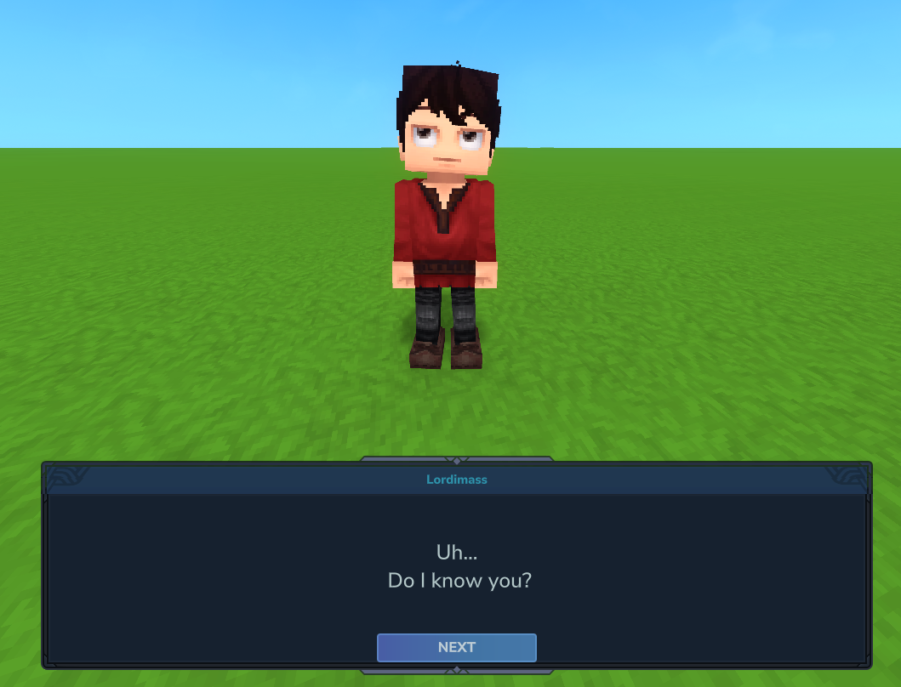

# Dialogue
[]()

[]()

Dialogue is a mod designed for Hytale server owners and developers to allow you to add custom dialogue and interactivity
to any NPC.

# Get Started
Dialogue adds a new NPC action `BeginDialogue` which is used to start a dialogue with a player. I recommend using this
inside of the `InteractionInstructions` block for your NPC. Here's a basic setup for your `InteractionInstruction`
block:
```json
{
  "InteractionInstruction": {
    "Instructions": [
      {
        "Continue": true,
        "Sensor": {"Type": "Any"},
        "Actions": [
          {
            "Type": "SetInteractable",
            "Interactable": true,
            "Hint": "dialogue.interactionHints.talk"
          }
        ]
      },
      {
        "Sensor": {"Type": "HasInteracted"},
        "Instructions": [
          {
            "Sensor": {
              "Type": "Not",
              "Sensor": {
                "Type": "State",
                "State": "$Interaction"
              }
            },
            "Actions": [
              {"Type": "LockOnInteractionTarget"},
              {
                "Type": "BeginDialogue",
                "Dialogue": "IntroDialogue01"
              },
              {
                "Type": "State",
                "State": "$Interaction"
              }
            ]
          }
        ]
      }
    ]
  }
}
```
The `Dialogue` parameter for the `BeginDialogue` refers to the ID of a `DialogueAsset`, which should be placed in 
`Server/Dialogue/`. These assets are the core of Dialogue's functionality, as they define the content and flow of the
interaction with NPCs. An example `DialogueAsset` is included below:
```json
{
  "Type": "Dialogue",
  "Entries": [
    {
      "Content": "dialogue.IntroDialogue01.content.0"
    }
  ],
  "Next": "IntroDialogue02"
}
```
| Key       | Example(s)                                                                                                                        | Description                                                                                                                                                                         |
|-----------|-----------------------------------------------------------------------------------------------------------------------------------|-------------------------------------------------------------------------------------------------------------------------------------------------------------------------------------|
| `Type`    | `"Dialogue"`, `"Choice"`                                                                                                          | The type of dialogue box to create. `"Dialogue"` is a standard box with text only, `"Choice"` creates a multiple choice box with different options for the player.                  |
| `Entries` | `[{"Content": "Dialogue content!"}]`,<br><br> `[{"Content": "Option1", "Next": "Option1DialogueResult"}, {"Content": "Option2"}]` | A list of `DialogueEntry` objects. If `Type` is `"Choice"` you can specify a `Next` on each entry to choose the dialogue asset to open when this option is chosen.                  |
| `Next`    | `"NextDialogueID"`                                                                                                                | The ID of the next dialogue asset to open when the user clicks "Next". If this is ommitted, this will be treated as the last in the chain and the button will read "Close" instead. |

# Localisation and `.lang` Files
Dialogue fully supports localisation of NPC dialogue, simply supply the `.lang` keys in your `DialogueAssets` and the
mod will take the correctly localised string for the given player.
## Dialogue Names
If you supply a key in `dialogue.lang` in the format `{{DialogueAssetID}}.name` you can supply a name for the NPC who
will be speaking the line.

# Dynamic and Rich Text Content
Sometimes you want a splash of colour in your dialogue, or perhaps some *italics*, or maybe even to refer to the player 
by name? You can do all of this using placeholders and rich text tags.

| Placeholder                              | Result                                         |
|------------------------------------------|------------------------------------------------|
| \<i>Italics\</i>                         | *Italics*                                      |
| \<b>Bold\</b>                            | **Bold**                                       |
| \<color is="#2e94ad">Colourful!\</color> | <span style="color: #2e94ad">Colourful!</span> |
|                                          |                                                |
| {username}                               | The player's username                          |
| {uuid}                                   | The player's UUID                              |
| {lang}                                   | The language the player is using, e.g. `en-US` |

You can even specify your own custom placeholders. Here's how we register the last three placeholders above:
```java
DialogueMod.get().registerParameter("{username}", PlayerRef.class, PlayerRef::getUsername);
DialogueMod.get().registerParameter("{uuid}", PlayerRef.class, p -> p.getUuid().toString());
DialogueMod.get().registerParameter("{lang}", PlayerRef.class, PlayerRef::getLanguage);
```

# Example Assets
Dialogue includes an example NPC and dialogue flow with the `Test_Dialogue` NPC role. Spawn them in your world to see 
how it all works.


# Credits
Parts of this plugin have been adapted from [Hyspeech](https://github.com/Naughty-Klaus/Hyspeech/tree/master) by
[NaughtyKlaus](https://github.com/Naughty-Klaus).